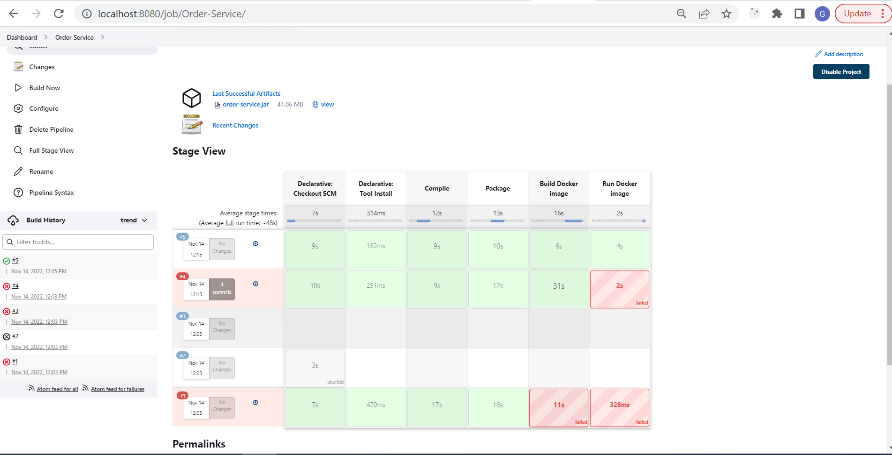
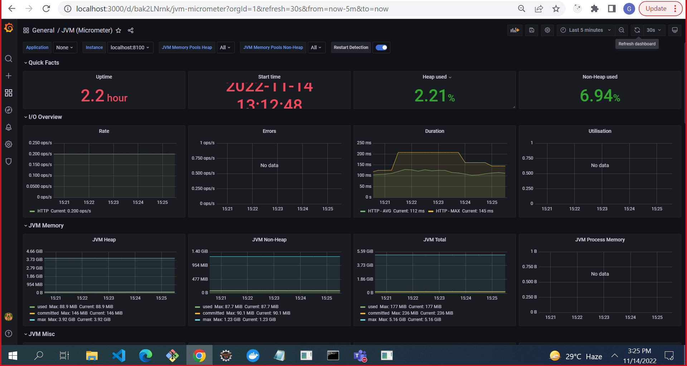
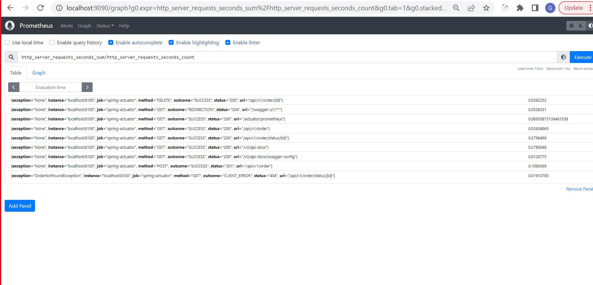
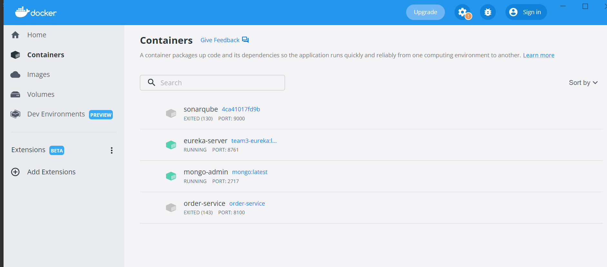

# Order Management  Application
The Problem Statement is to Create Order Management Service and Validate the endpoints using Swagger. This version of code allows to create the Order, to get the details of the order based on id, update order and delete/Cancel order entry from the System. 

### Tech Stack:

- Java
- Maven
- Spring Boot 
- Swagger open doc
- Docker 
- Jenkins
- Prometheus
- Grafana

### Swagger Api Docs

### Jenkins Pipeline

### Grafana Dashboard

### Prometheus Dashboard

### Docker

