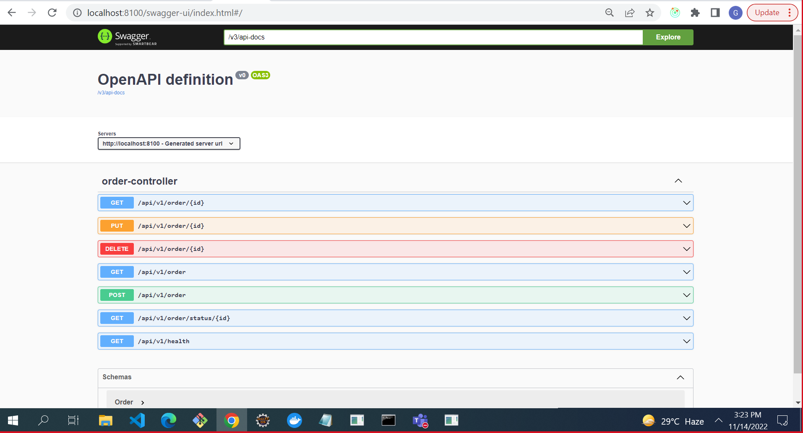

# Order Management  Application
This project is developed in Spring boot using Java 8. Database used to store records in MongoDB. Maven is used for building jar file and docker is used to create containers. Swagger is used to maintain the API documentation. This version of code allows someone to get the order the details, create order with multiple items, create/update bulk order and delete order entry from the system.

### Tech Stack:

- Java
- Maven
- Spring Boot 
- Swagger open doc
- Docker 
- Jenkins
- Prometheus
- Grafana
- Junit
- Postman

### Swagger Api Docs

### Jenkins Pipeline

### Grafana Dashboard

### Prometheus Dashboard

